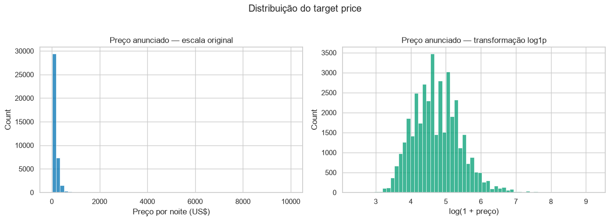

# EDA dos anúncios do Airbnb em Nova York

| Informação | Detalhe |
|---|---|
| Projeto | APS1 de Machine Learning — Insper |
| Autor | Djairo Dantas da Silva Filho |
| Data de entrega | 14/09/2026 |

Este projeto investiga como localização, tipo de acomodação, disponibilidade e
atividade de avaliações se relacionam com o **preço anunciado** de uma diária do
Airbnb em Nova York em 2019.

## Escopo

Cada linha representa um anúncio, não uma reserva concluída. Os resultados
descrevem preços anunciados e não receita, ocupação ou demanda efetiva.

## Principais resultados

| Evidência | Resultado |
|---|---:|
| Anúncios na base original | 48.895 |
| Mediana do preço no treino | US$ 106 |
| Média do preço no treino | US$ 153,18 |
| Mediana de acomodação inteira | US$ 160 |
| Mediana de Manhattan | US$ 150 |
| Variância explicada por PC1 + PC2 | 43,8% |



## Caminho da análise

```text
dados brutos
    → auditoria de qualidade
    → limpeza determinística
    → separação treino e teste
    → EDA apenas no treino
    → pipeline e PCA
    → preparação para APS2
```

## Conclusão executiva

A distribuição de preços tem uma cauda longa e torna a mediana mais informativa
que a média para descrever o anúncio típico. Tipo de acomodação e localização
separam grupos com preços bastante diferentes, enquanto correlações lineares
isoladas com o target são fracas. O pipeline preserva essas informações sem
aprender estatísticas do conjunto de teste.

Manhattan e Brooklyn concentram 85,5% do treino, o conjunto cobre apenas
anúncios presentes na plataforma e faltam características relevantes dos
imóveis.

[Consultar os resultados](resultados.md){ .md-button .md-button--primary }
[Executar o projeto](reproducao.md){ .md-button }
