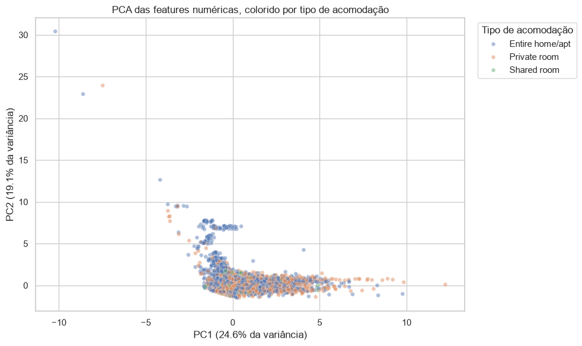

# PCA das variáveis numéricas

O PCA cria combinações das variáveis originais. PC1 preserva a maior direção de
variação e PC2 preserva a maior parte restante, sendo perpendicular a PC1.

Antes do ajuste, as variáveis numéricas são imputadas pela mediana e
padronizadas somente com o treino.

Mesmo após a padronização, `StandardScaler` e PCA são sensíveis a observações
extremas. Os componentes e a amplitude dos eixos devem ser interpretados com
essa limitação. A ressalva segue a documentação do
[`StandardScaler`][standard-scaler] e do [PCA][pca-doc] no scikit-learn.

## Interpretação

| Componente | Variância explicada | Maiores contribuições |
|---|---:|---|
| PC1 | 24,6% | Total e média mensal de avaliações |
| PC2 | 19,1% | Disponibilidade, escala do anfitrião e mínimo de noites |
| Total | 43,8% | Resumo parcial das variáveis numéricas |

Os tipos de acomodação se sobrepõem nos dois componentes, sem separação clara.
Isso não torna room_type inútil: PCA maximiza variância das features e não a
capacidade de prever preço.

O PCA é usado como ferramenta exploratória, não como prova de desempenho,
robustez ou causalidade.

[standard-scaler]: https://scikit-learn.org/stable/modules/generated/sklearn.preprocessing.StandardScaler.html
[pca-doc]: https://scikit-learn.org/stable/modules/generated/sklearn.decomposition.PCA.html
