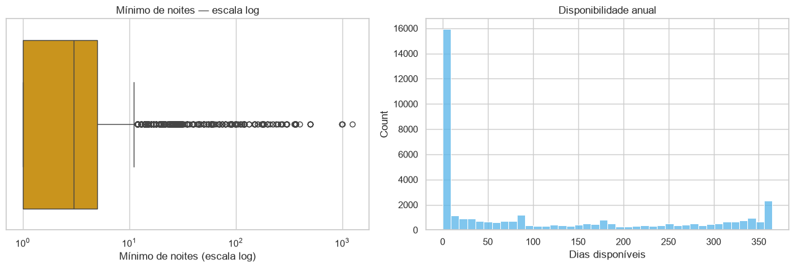
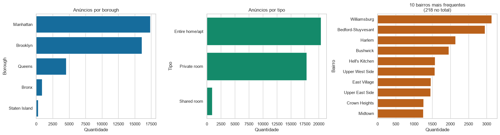
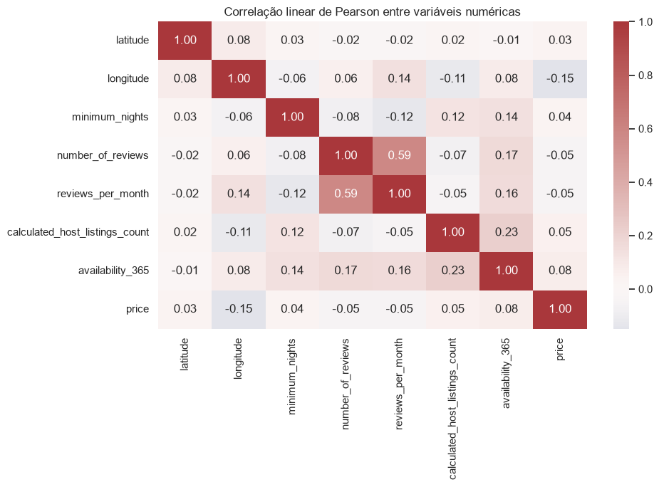
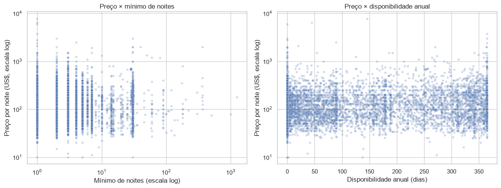
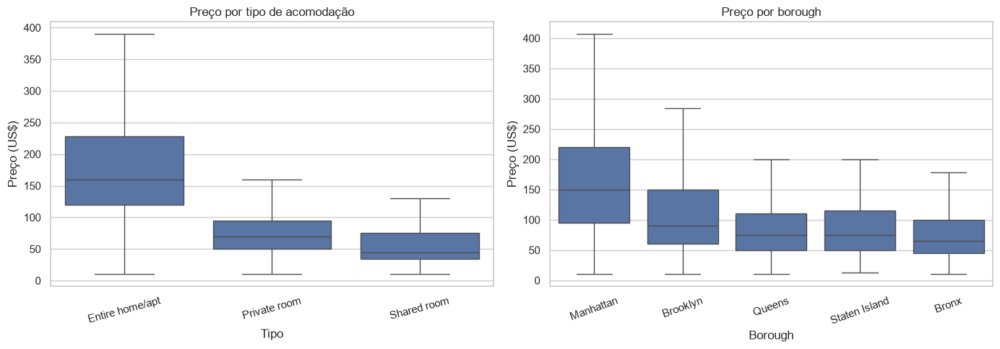
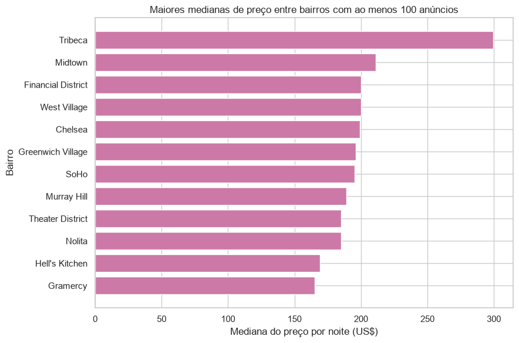
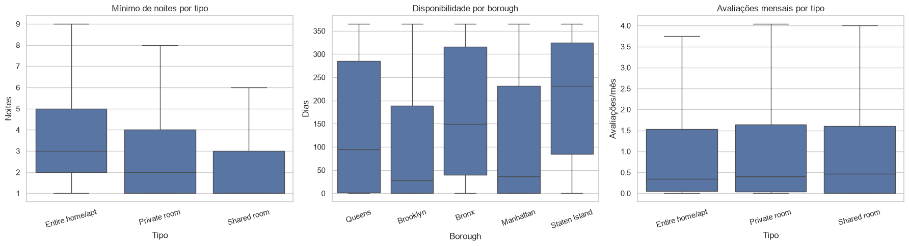

# Resultados da EDA

## Distribuições numéricas

O preço possui forte cauda à direita. A mediana de US$ 106 é menor que a média
de US$ 153,18, mostrando que poucos anúncios caros deslocam a média. A
transformação log1p é uma hipótese para a APS2, com avaliação final também na
escala original de dólares.

O mínimo de noites se concentra em valores baixos, mas apresenta extremos. A
disponibilidade ocupa todo o intervalo de zero a 365 dias e não deve ser
interpretada como ocupação observada.

## Composição das categorias

Manhattan e Brooklyn dominam a amostra. A alta cardinalidade dos bairros apoia o
uso de one-hot encoding capaz de lidar com categorias ainda não observadas.

## Relações numéricas

Com Pearson e `price` na escala original, as correlações lineares são fracas. A
comparação com Spearman e com `log1p(price)` mostra que o resultado depende da
medida e da escala:

| Variável | Pearson: `price` | Spearman: `price` | Pearson: `log1p(price)` |
|---|---:|---:|---:|
| `longitude` | -0,149 | -0,441 | -0,330 |
| `latitude` | 0,035 | 0,137 | 0,081 |
| `calculated_host_listings_count` | 0,055 | -0,108 | 0,131 |
| `minimum_nights` | 0,038 | 0,100 | 0,030 |
| `availability_365` | 0,078 | 0,084 | 0,097 |
| `reviews_per_month` | -0,050 | -0,058 | -0,061 |
| `number_of_reviews` | -0,047 | -0,051 | -0,042 |

A associação monotônica moderada da longitude provavelmente resume diferenças
espaciais entre regiões. Ela não prova causalidade nem importância preditiva.

Os dispersogramas mostram sobreposição e ausência de uma tendência linear
simples. A amostra de pontos serve somente à visualização; o pipeline utiliza
todo o treino.

## Preço por categoria

Acomodações inteiras têm mediana de US$ 160; quartos privados, US$ 70; e quartos
compartilhados, US$ 45. Manhattan apresenta mediana de US$ 150, contra US$ 90 no
Brooklyn e US$ 65 no Bronx.

O corte mínimo de 100 anúncios reduz o risco de destacar medianas instáveis de
grupos pequenos. As diferenças observadas são associações e não efeitos causais.

## Relações entre numéricas e categóricas

Mínimo de noites, disponibilidade e avaliações mensais variam entre grupos,
sugerindo que interações podem ser úteis na etapa de modelagem.
